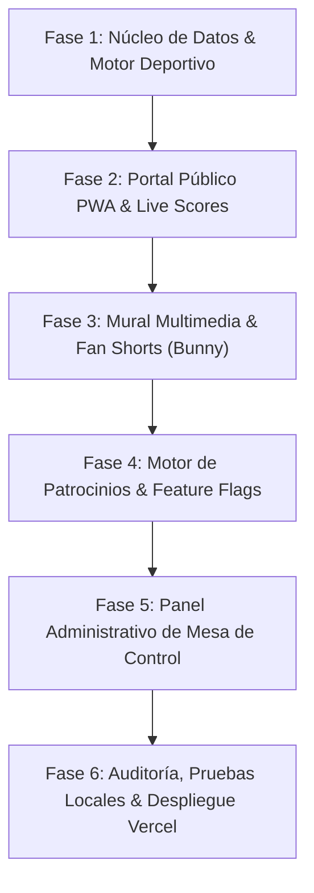

# Plan maestro de ingeniería de software y arquitectura modular
## Plataforma digital y WebApp multideportiva • Liga de la Costa de Oro 2026

**Proyecto:** `EventoCostadeOro` (Liga de la Costa de Oro 2026 / Curiol Sports Engine)  
**Institución anfitriona:** La Paz Community School  
**Desarrollado por:** Curiol Studio • *Fotografía • Tecnología • Legado*  
**Enfoque de diseño:** Arquitectura de máxima capacidad (Opción 3 + *Fan Shorts* + Patrocinios + Base de Datos + Multi-Tenant para catálogo SaaS)  
**Fecha de planificación:** 26 de septiembre de 2026  

---

## 1. Visión y estrategia de ingeniería

### 1.1. Filosofía de desarrollo: "Construir al 100%, modularizar por configuración"
Para maximizar el valor comercial y técnico, el sistema se construirá desde su arquitectura base con **todas las funcionalidades de la opción más completa (Opción 3)**. 
Mediante un archivo de configuración (*Feature Flags / Tenant Settings*), la plataforma puede operar como:
* **Modo Institucional (Opción 1):** Módulos publicitarios y votaciones desactivados (interfaz 100% sobria).
* **Modo Co-Gestión (Opción 2):** 4 marcas colaborativas 50/50 + votación de atletas + fotos con marco.
* **Modo Comercial Autónomo (Opción 3):** Patrocinador titular exclusivo + directorio con WhatsApp + *Fan Shorts* con botón de comercios.
* **Producto de Catálogo SaaS (Curiol Sports Hub):** Plataforma reutilizable para vender a otros colegios, academias y torneos en Costa Rica y el exterior sin rehacer código.

### 1.2. Análisis de infraestructura y recomendación de base de datos
* **Evaluación de servicios existentes:** Curiol Studio ya dispone de entornos en Supabase / PostgreSQL y Bunny.net.
* **Recomendación técnica:**  
  * **No crear proyectos pagados adicionales ni dispersar cuentas.**  
  * Implementar un **modelo multi-inquilino (*Multi-Tenant*)** con namespace `tournament_id = 'costa-de-oro-2026'`.
  * **Desarrollo *Local-First*:** Soporte para SQLite / Mock Store en desarrollo local y sincronización con Supabase PostgreSQL para producción.
  * **Cero costo extra de infraestructura:** Aprovechamos la cuota existente sin generar gastos mensuales.

---

## 2. Pila tecnológica (Tech Stack)

| Capa | Tecnología | Justificación |
| :--- | :--- | :--- |
| **Framework Web & API** | **Next.js 16 (App Router) + React 19** | Renderizado híbrido (SSR/SSG/PWA), velocidad de carga instantánea en móviles y API Routes integradas. |
| **Lenguaje** | **TypeScript 5 (Strict Mode)** | Tipado estricto de categorías, actas, partidos y tablas para evitar errores en tiempo de ejecución. |
| **Estilos & UI** | **Tailwind CSS + Lucide Icons + Framer Motion** | Diseño limpio, responsivo para celulares y transiciones fluidas de marcadores y galerías. |
| **Base de Datos** | **PostgreSQL (Supabase) / Local Adapter** | Integridad relacional para tablas de posiciones, cruces de finales y actas de mesa. |
| **Video & Multimedia** | **Bunny.net (Bunny Stream Direct Upload)** | Subida de videos cortos (9:16) sin pasar por el servidor web, transcodificación HLS automática y costo < $2 USD. |
| **Almacenamiento de Fotos** | **Supabase Storage / Edge CDN** | Carga y optimización de fotos familiares y marcos conmemorativos. |
| **Despliegue & CI/CD** | **Vercel Edge Network + GitHub** | Despliegue continuo con dominio personalizado y SSL automático. |

---

## 3. Plan de trabajo estructurado por fases



---

### 🔹 Fase 1: Núcleo de datos, esquema relacional y motor de cálculo deportivo
* **Objetivo:** Crear la estructura de datos desacoplada y los algoritmos de cálculo de puntos para los 3 deportes.
* **Entregables:**
  1. Modelo de datos relacional:
     * `tournaments` (Configuración de torneo, fechas, sedes, reglas de puntuación).
     * `schools` (Las 6 instituciones: CRIA, Journey, Vittorino, Educarte, La Paz Cabo Velas, La Paz Tempisque).
     * `categories` (Las 7 categorías oficiales: Fútbol Fem, Fútbol C, Fútbol D, Voleibol Fem C/D, Baloncesto C/D).
     * `matches` (Programación de partidos, canchas, estados: programado, en vivo, finalizado).
     * `standings` (Cálculo de victorias, empates, derrotas, goles/puntos/sets a favor y en contra, gol diferencia).
  2. Motor de cálculo de posiciones con soporte para reglas específicas:
     * Fútbol: 3 pts victoria, 1 pt empate, 0 pt derrota.
     * Baloncesto: 2 pts victoria, 1 pt derrota.
     * Voleibol: sistema de sets ganados/perdidos y puntos totales.
  3. *Seeding* de datos iniciales del calendario oficial (5-9 oct, 2-6 nov, 16-20 nov y finales 23-27 nov).
* **Validación de la fase:** Pruebas unitarias del motor de cálculo de tablas y cruces de finales.

---

### 🔹 Fase 2: Portal público PWA de alta velocidad (*Fan Experience & Live Hub*)
* **Objetivo:** Construir la interfaz de usuario móvil que consultarán las más de 500 familias y atletas.
* **Entregables:**
  1. Cabecera institucional dinámica adaptable a la identidad del torneo y de La Paz Community School.
  2. Selector de disciplinas deportivas y pestañas de categorías en un solo toque.
  3. Módulo de **Partidos del Día en Vivo (*Live Scores*)**:
     * Estado del encuentro en tiempo real.
     * Asignación de canchas y sedes (Cabo Velas y Tempisque).
  4. Módulo de **Tablas de Posiciones**:
     * Visualización clara y ordenada de líderes por categoría.
     * Marcador visual de equipos en zona de clasificación a finales (1.° y 2.° puesto).
  5. Navegación fluida tipo app nativa (*PWA manifest, iconos y offline fallback*).
* **Validación de la fase:** Revisión local en resoluciones móviles (iPhone, Android) con tiempo de carga inferior a 1 segundo.

---

### 🔹 Fase 3: Mural comunitario multimedia (*Fan Gallery & Shorts con Bunny Stream*)
* **Objetivo:** Espacio interactivo para que las familias compartan fotos y videos cortos de las jugadas.
* **Entregables:**
  1. Módulo de subida de fotos familiares con previsualización y compresión en el cliente.
  2. Integración de **Bunny Stream** para videos cortos (*Fan Shorts*):
     * *Direct Upload API* para subir videos verticales (9:16) directamente a Bunny.net.
     * Reproductor de video integrado sin publicidad ni enlaces externos.
  3. Módulo de **Votación Comunitaria del Jugador del Partido**:
     * Listado de atletas destacados por jornada.
     * Sistema de control de votos para evitar duplicados por dispositivo.
  4. Panel de moderación rápida para aprobación o eliminación de contenidos inapropiados.
* **Validación de la fase:** Prueba de subida de fotos y videos cortos con reproducción adaptativa en tiempo real.

---

### 🔹 Fase 4: Motor de patrocinios, monetización y catálogo de software
* **Objetivo:** Habilitar los espacios comerciales y el sistema de activación de módulos por configuración.
* **Entregables:**
  1. Configuración de **Feature Flags / Modos de Plataforma**:
     * `OPCION_1_INSTITUCIONAL`: Desactiva sponsors y votaciones.
     * `OPCION_2_COGESTION`: Activa 4 marcas comerciales + votación de atletas.
     * `OPCION_3_AUTONOMA`: Activa patrocinador titular + directorio comercial completo.
  2. Directorio interactivo de comercios aliados:
     * Tarjetas de beneficios familiares con botón de enlace directo a WhatsApp.
  3. Banners dinámicos de patrocinadores integrados sutilmente entre partidos y en el pie de página.
* **Validación de la fase:** Cambio de modo mediante configuración y verificación de que la interfaz se adapte instantáneamente.

---

### 🔹 Fase 5: Panel administrativo de mesa de control (*Match Control*)
* **Objetivo:** Formulario privado para que los delegados de mesa o Curiol Studio registren marcadores al instante.
* **Entregables:**
  1. Acceso administrativo protegido mediante PIN o clave de delegado.
  2. Formulario web ágil y simplificado para mesa de control:
     * Selección de partido.
     * Registro de marcadores finales, sets o cuartos.
     * Botón de «Finalizar y publicar tabla».
  3. Panel de gestión de incidencias, reprogramaciones de partidos por lluvia y ajuste de horarios.
* **Validación de la fase:** Simulación de una jornada completa de partidos con actualización en vivo de tablas desde el móvil.

---

### 🔹 Fase 6: Auditoría de seguridad, verificación de compilación y despliegue
* **Objetivo:** Asegurar la calidad, estabilidad y preparación para puesta en producción.
* **Entregables:**
  1. Verificación de reglas globales de Antigravity:
     * Cero placeholders y cero código simulado.
     * Tipado estricto en TypeScript sin errores de compilación (`npm run build`).
  2. Configuración de variables de entorno seguras (`.env.local` y `.env.production`).
  3. Vinculación del repositorio en GitHub (`curiol-studio/evento-costa-de-oro-2026`).
  4. Configuración de despliegue en Vercel con subdominio oficial (`ligacostadeoro.curiolstudio.com` o dominio propio).
* **Validación de la fase:** Despliegue exitoso en Vercel con auditoría Lighthouse > 90 en rendimiento, accesibilidad y PWA.

---

## 4. Estructura de carpetas propuesta para el proyecto

```text
EventoCostadeOro/
├── assets/                  # Logotipos oficiales 4K, SVG y códigos QR
├── prototipos/              # Maquetas estáticas de referencia
├── src/
│   ├── app/                 # Rutas de Next.js App Router
│   │   ├── layout.tsx       # Layout principal PWA
│   │   ├── page.tsx         # Portada oficial y Live Hub
│   │   ├── calendario/      # Vista completa de jornadas y fechas
│   │   ├── posiciones/      # Tablas por disciplina y categoría
│   │   ├── mural/           # Galería de fotos y Fan Shorts
│   │   ├── beneficios/      # Directorio de comercios y WhatsApp
│   │   ├── admin/           # Panel privado de mesa de control
│   │   └── api/             # Endpoints (subidas Bunny, actas, votación)
│   ├── components/          # Componentes modulares reutilizables
│   │   ├── ui/              # Botones, modales, tarjetas, badges
│   │   ├── sports/          # Marcadores, tablas, selectores de deportes
│   │   ├── media/           # Reproductor de Shorts, subidor de fotos
│   │   └── sponsors/        # Banners dinámicos, directorio de marcas
│   ├── config/              # Feature flags y configuración de inquilinos
│   │   └── tournament.ts    # Configuración de La Paz Costa de Oro 2026
│   ├── lib/                 # Base de datos, clientes Supabase y Bunny
│   └── types/               # Definiciones de tipos TypeScript del torneo
├── public/                  # Favicons, manifest PWA e imágenes estáticas
├── package.json
└── tsconfig.json
```

---

## 5. Próximos pasos inmediatos

1. **Aprobación de la arquitectura por fases.**
2. **Inicio de la Fase 1:** Inicialización del proyecto Next.js 16 + TypeScript + Tailwind CSS, modelo de datos relacional y motor de cálculo deportivo.
